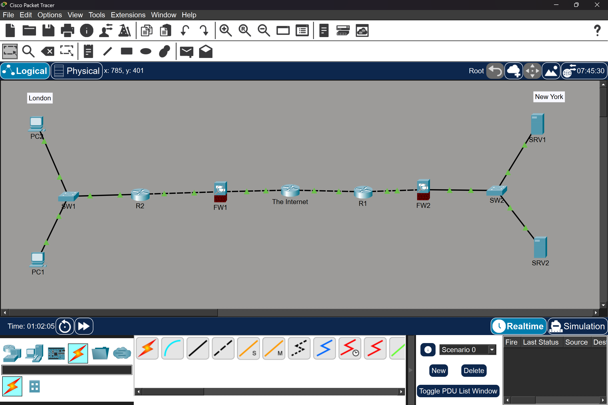
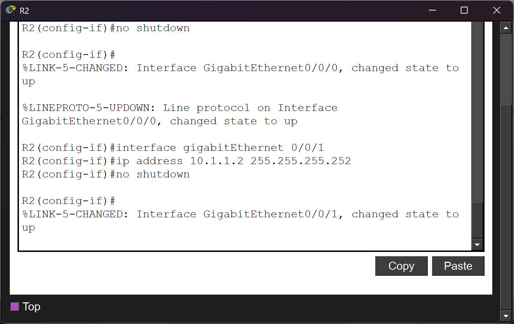
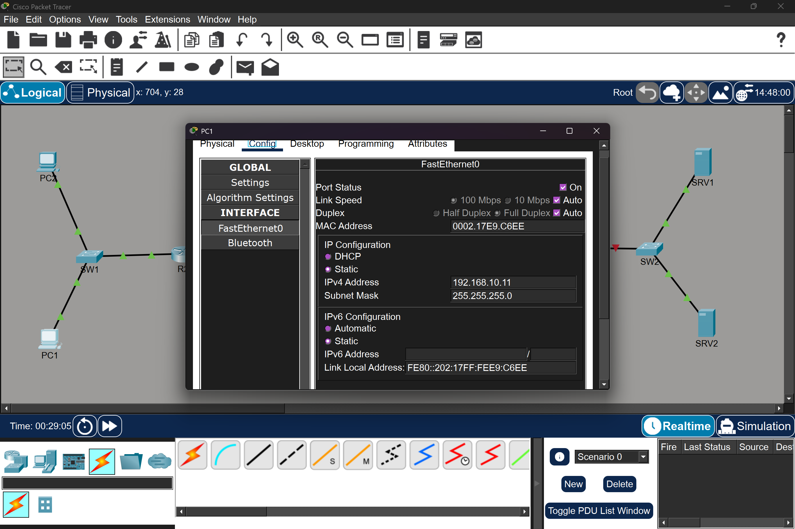
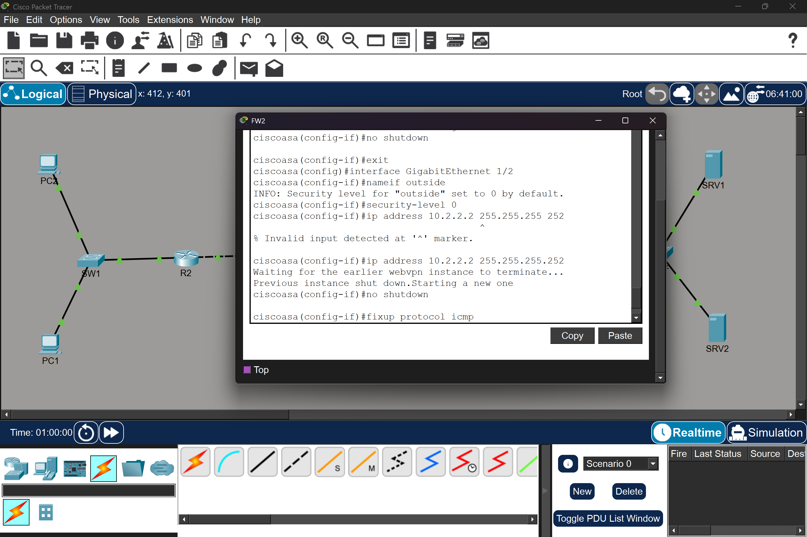
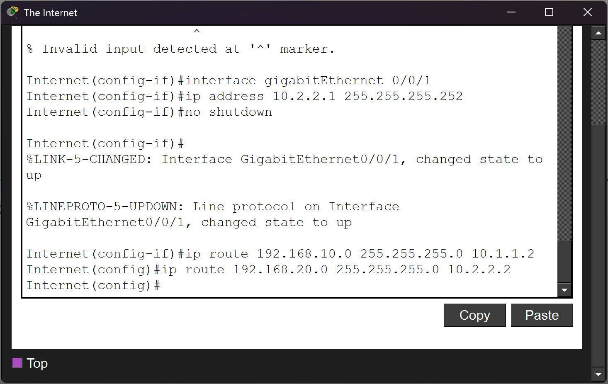

# Secure Multi-Site Enterprise Network (London to New York)

## 🌐 Project Overview
This project simulates a secure connection between two international corporate branches (**London** and **New York**) through a service provider "Internet" router. The architecture implements a layered security approach using Cisco ASA 5506-X firewalls and ISR 4331 routers.

## 📸 Project Gallery

### Device Initialization & Syslog

*Manual interface activation showing the resulting Syslog Level 5 (Notice) notifications.*

### End-Device Configuration

*Configuration of the London Branch PC with appropriate Gateway and Subnet Mask.*

### Firewall Security Logic

*Applying security levels and names to interfaces to define the trusted and untrusted zones.*

### Core Routing Knowledge

*The static routing table on 'The Internet' router used to bridge the London and New York branches.*

## 🎓 Skills Learned & Professional Growth
* **Stateful Firewall Logic:** Learned that firewalls are "secure by default" and require explicit configuration (like `fixup protocol icmp`) to allow diagnostic traffic.
* **Subnet Architecture:** Gained a deep understanding of why interfaces must reside on unique subnets and how to resolve overlap errors in a production-style environment.
* **Log-Based Verification:** Moved beyond relying on visual "green lights" in Packet Tracer to using Syslog Level 5 (Notice) messages to confirm line protocol status.
* **Static Routing Propagation:** Mastered the flow of traffic through multiple hops, learning how to bridge private branch networks across a public internet gateway.
* **CLI Command Proficiency:** Developed technical agility with Cisco IOS and ASA CLI, including bypassing setup prompts and managing complex interface naming conventions.

## 🚧 Troubleshooting & Problem Solving
Building this lab required resolving several real-world networking challenges:

### 1. Subnet Overlap Resolution
* **The Issue:** Encountered an error stating `% 10.1.1.0 overlaps with GigabitEthernet1/1` on the ASA firewall.
* **The Fix:** I identified that the `inside` and `outside` interfaces were assigned to the same subnet. I redesigned the IP plan to ensure unique subnets for each segment, allowing the firewall to route traffic correctly.

### 2. Enabling ICMP (Ping) through ASA
* **The Issue:** Physical links were "Up/Up," but pings were being dropped by the firewall.
* **The Fix:** Since ASAs block ICMP by default, I applied the `fixup protocol icmp` command to allow diagnostic traffic for testing.

### 3. Verification via Syslog
* **The Implementation:** I used **Level 5 (Notice)** messages to confirm link stability. Monitoring `%LINK-5-CHANGED` and `%LINEPROTO-5-UPDOWN` logs ensured that my manual configurations were accepted by the hardware.

